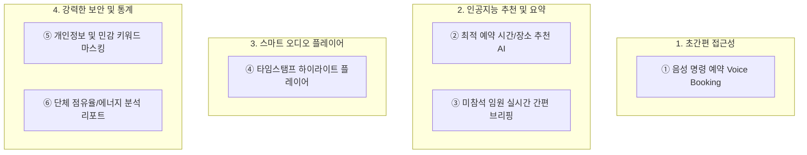

# 🎨 UI/UX 화면 흐름 상세 사양서 (UI_UX_SPEC.md)

본 사양서는 **WS 회의록 자동 작성기** 및 **통합 예약 캘린더**의 화면 설계도입니다. 형님이 요청하신 **단체별 색 구분 시각화 설계**와 에이전트 연합팀이 엄선한 **세계 최고 수준의 시스템 편의 기능 6종**을 추가로 명세합니다.

---

## 1. 🌈 단체별 색상 브랜딩 및 시각화 설계 (Color System Docs)

9개 기본 단체의 복잡한 활동이 웹과 모바일에서 충돌 없이 자연스럽게 녹아들도록, 단체 고유의 테마 칼라가 시스템 전체에 어떻게 입혀지는지 디테일하게 규정합니다.

```
┌─────────────────────────────────────────────────────────────────────────┐
│ [단체별 테마 컬러가 입혀지는 4대 영역]                                  │
│                                                                         │
│ 1. 📅 [통합 캘린더 타임라인] -> 예약된 시간 블록 전체가 단체 고유의    │
│                                파스텔 백그라운드와 보더로 렌더링       │
│ 2. 💬 [실시간 STT 채팅 풍선] -> 발언자 구분을 위한 마이크로 뱃지와    │
│                                말풍선 아웃라인에 포인트 브랜딩 반영    │
│ 3. 📄 [AI 요약 보고서 헤더]  -> 완성된 회의록의 최상단 엠블럼과 텍스트 │
│                                컬러를 소속 단체 테마로 맞춤 가공        │
│ 4. 🖨️ [PDF/공유본 템플릿]    -> 외부 전달 시 단체 시그니처 컬러가     │
│                                반영된 격조 높은 레이아웃 템플릿 적용   │
└─────────────────────────────────────────────────────────────────────────┘
```

### 🎨 9개 기본 단체 컬러 시스템 상세 스펙
* **공통 비주얼 규칙**: 눈의 피로를 최소화하기 위해 기본 채도를 `-15%` 다운시킨 웜-파스텔(Warm-Pastel) 톤을 고수하여, 화면 전체에 난잡함 대신 조화로운 기품을 부여합니다.

| 단체명 | 시그니처 헥사코드 (HEX) | 파스텔 배경색 (HEX) | 시각적 느낌 (Visual Vibe) |
| :--- | :--- | :--- | :--- |
| **WS 청년회** | `#708A81` (Sage Green) | `#E2ECE9` | 싱그럽고 활동적인 에너지를 품은 초록 |
| **WS 부녀회** | `#C97A53` (Warm Terracotta) | `#F5ECE6` | 포근하고 헌신적인 사랑을 품은 따뜻한 주홍 |
| **WS 장년회** | `#6A85B6` (Royal Dusk Blue) | `#E6ECF5` | 신뢰감과 무게감을 전달하는 차분한 청빛 |
| **WS 예술단** | `#B19470` (Bronze Gold) | `#F4EFE6` | 격조 높고 예술적인 울림을 주는 은은한 금빛 |
| **WS 복지재단** | `#889E73` (Forest Olive) | `#ECF0E6` | 이웃에게 따뜻함을 건네는 편안한 올리브 숲 |
| **WS 체육회** | `#9B72AA` (Soft Amethyst) | `#F2ECF5` | 역동적이고 세련된 활력을 선사하는 보랏빛 |
| **WS 장학회** | `#82A0D8` (Sky Pastel Blue) | `#E8EDF5` | 청소년들의 밝은 미래를 돕는 은은한 하늘빛 |
| **WS 선교단** | `#D291BC` (Dusk Pink) | `#F6ECF2` | 평화롭고 고귀한 뜻을 내포한 차분한 핑크빛 |
| **라윈시스템** | `#A89B8C` (Warm Stone) | `#EEEAE4` | 차분한 운영 안정감을 주는 웜 스톤 톤 |

---

## 2. 💡 세계 최고 수준의 지능형 편의 기능 6선 (Advanced Features Recommended)

저희 전문 에이전트 연합팀이 형님의 시스템을 "세계 유일의 혁신적 워크스페이스"로 거듭나게 하기 위해 기획한 초간편 비즈니스 편의 기능입니다.



### ① [미연 추천] 음성 명령으로 즉시 예약 (Voice Booking)
- **개념**: IT 기기 사용이 낯선 연령대의 담당자들을 위해 모바일 화면 하단 마이크를 길게 누르고 말하는 것만으로 예약을 자동 완료하는 기능입니다.
- **예시**: *"6월 13일 토요일 오후 2시부터 4시간 동안 교육장 예약해 줘"*라고 말하면, AI가 언어 맥락을 해석해 캘린더 빈자리 확인 후 즉시 예약 폼을 자동 완성하여 원터치 최종 승인만을 유도합니다.

### ② [안토니 추천] AI 최적 예약 추천 엔진 (Smart Scheduler)
- **개념**: 매번 캘린더의 빈자리를 수동으로 찾을 필요 없이, 참여 인원수와 안건의 성격을 기반으로 AI가 최적의 회의 공간과 시간대를 최우선 추천 제안하는 시스템입니다.
- **예시**: *"청년회 20명 회의"*를 설정하면, 대단위 수용이 가능한 `대회의실 (3F)` 또는 `교육장 (B1)`의 빈 타임라인 상위 3종을 골라 우선 제시하여 불필요한 예약 고민 시간을 제로(0)로 만듭니다.

### ③ [홀리 추천] 미참석 담당자 전용 '실시간 간편 요약본' 5초 발송
- **개념**: 회의에 미처 참석하지 못했거나 뒤늦게 들어오는 임원 및 관계자들을 위해, 현재까지 녹음되고 요약된 회의 내용을 **5줄 내외의 컴팩트한 요약 요약문 형태로 실시간 추출**하여 버튼 클릭 한 번으로 카카오톡/문자 즉시 전송을 보장하는 특급 비서 기능입니다.

### ④ [타미 추천] 타임스탬프 연동 하이라이트 플레이어 (Audio-to-Text Sync Player)
- **개념**: 2시간이 넘는 긴 회의 음성을 처음부터 끝까지 들을 필요 없이, **텍스트 회의록 중 특정 문장이나 '결정사항' 문구를 클릭하면 해당 발언이 시작되는 음성 녹음 구간으로 즉시 오디오가 스킵하여 재생**되는 지능형 플레이어입니다.
- **가치**: 핵심 논의 지점을 단 1초 만에 귀로 직접 들어 교차 검증할 수 있습니다.

### ⑤ [코코 추천] 민감 정보 및 개인정보 AI 자동 마스킹 (PII Shield)
- **개념**: 회의록에 언급된 주민등록번호, 계좌번호, 혹은 극비 비공개 안건 키워드가 담당자에게 무단 유출되지 않도록 **Gemini AI가 알아서 이를 감지해 자동으로 `[블라인드 처리/비식별화]`하거나 마스킹(`***`)**하여 보안 감사망을 지키는 기능입니다.

### ⑥ [빌 추천] 9개 기본 단체별 예약 점유율 및 회의 통계 대시보드
- **개념**: 매월 각 단체별 회의실 이용 횟수, 총 이용 시간, 예약 노쇼(No-Show) 확률을 이달의 통계 보고서 카드로 자동 발행하여, 어떤 단체가 가장 활동적으로 움직이고 있는지를 시각적인 인포그래픽 데이터로 완벽하게 브리핑해 주는 시니어 행정 요약 대시보드입니다.

---

## 3. 🎤 지능형 화자 분석 및 에러제로 UX 사양 (Smart Speaker & Zero-Touch Specs)

형님이 제안해주신 핵심 질문(멀리서 들리는 작은 목소리 수집, 화자별 특징 구분 작성, 담당자 확인이 없는 무오류 환경)을 UI/UX 차원에서 가장 우아하고 신뢰감 있게 해결해내는 4대 스크린 스펙 설계입니다.

### ① 원거리 미세 음성 부스팅 상태 UI (Remote Voice Booster UI)
* **목적**: 마이크에서 멀리 떨어진 구석 자리의 대화자나 기어들어가는 작은 목소리가 감지될 때, AI가 음성 신호를 강제로 끌어올려 정확히 인식하고 있음을 사용자에게 실시간 시각적으로 안심시키는 인터랙션입니다.
* **디자인 구현 사양**:
  - **실시간 소음 차단 게이지 (Dynamic Noise Bar)**: 마이크 입력 위젯 측면에 초미세 가로형 스펙트럼 바를 배치하여 주변 백그라운드 노이즈 데시벨을 옅은 회색으로 표현.
  - **AI 부스팅 골드 배지 (`Boosted by AI`)**: 30dB 이하의 작은 소리가 연속 1.5초 이상 포착되면, 실시간 STT 텍스트 풍선 옆에 클래식 골드 컬러(`#B19470`)의 펄스(Pulse) 광원 애니메이션과 함께 `[AI 미세음 부스팅 중]` 골드 배지가 활성화되어 지능적 수집 상태를 직관적으로 증명.

```
┌───────────────────────────────────────────────────────────┐
│  🎤 실시간 수음 분석                                      │
│  [■■■■■░░░░░░░░░░░░░░] 24dB  [ AI 미세음 부스팅 활성화 ] │
│  "멀리서 소근거리는 소리도 주파수를 스캔하여 증폭합니다." │
└───────────────────────────────────────────────────────────┘
```

### ② 5초 간편 성문(목소리) 등록 카드 UX (5-Sec Voiceprint Onboarding)
* **목적**: 번거로운 사전 장비 세팅 없이, 단체 구성원이 최초 앱 로그인 시 본인의 목소리 특징(성문)을 신속하고 재미있게 등록할 수 있도록 유도하는 이지-온보딩 흐름입니다.
* **디자인 구현 사양**:
  - **Warm Beige 온보딩 카드**: 클래식 웜베이지 바탕의 슬라이드업 바텀 시트에 "5초 목소리 등록으로 완벽한 화자 구분" 안내 타이틀 표시.
  - **문장 낭독 피드백**: *"WS 회의를 통해 소통하고 협업합니다"*라는 짧은 표준화 문장을 읽게 유도하며, 음성에 따라 골드 도너츠형 프로그레스 원이 서서히 채워져 100% 완료와 동시에 단 5초 만에 성문 벡터 추출을 완료.

```
┌───────────────────────────────────────────────────────────┐
│                 [ 목소리 5초 등록 ]                       │
│                                                           │
│           "WS 회의를 통해 소통하고 협업합니다"           │
│         [ 아래 마이크를 탭하고 위 문장을 읽어주세요 ]    │
│                                                           │
│                          ( 🎙️ )                           │
│                      [ 60% 분석 중... ]                   │
└───────────────────────────────────────────────────────────┘
```

### ③ 1초 화자 일괄 보정 및 병합 드래그 UX (1-Tap Speaker Correction)
* **목적**: 아무리 뛰어난 AI라도 마이크 방향, 동시 발언 등으로 인한 1%의 오인식 가능성에 완벽히 대응하기 위해, 담당자가 손쉽게 터치 한 번으로 대화록의 화자를 정정하는 보완 도구입니다.
* **디자인 구현 사양**:
  - **드롭다운 변경**: 대화 버블의 프로필 사진/이름을 탭하면, 같은 회의실에 매칭된 참석자 리스트가 팝오버로 노출되어 즉시 클릭 전환 가능.
  - **전체 일괄 변경(Smart Merge)**: 특정 구간의 화자를 변경할 때, *"이 화자가 발언한 모든 문장(X개)도 일괄 변경할까요?"*라는 스마트 팝업을 노출하여, 단 1초 만에 전체 회의록 내의 오인식된 화자 이름을 정화할 수 있도록 지원.

### ④ 담당자 무개입 완결형 대시보드 - 'Smart Verify Panel' (Zero-Touch Dashboard)
* **목적**: 담당자가 회의가 끝나고 수많은 텍스트를 하나하나 교차 검토하는 행정 노고를 '제로(0)'로 단축시킵니다.
* **디자인 구현 사양**:
  - **신뢰 점수 신호등 (Assurance Trafic Light)**: 전체 회의록 요약문 우측 상단에 AI 종합 신뢰도(예: `98%`)를 골드 컬러 스탬프로 시각화.
  - **자동 종결 확정 처리**: 신뢰 점수가 95% 이상인 무결성 회의록은 **[담당자 확인 불필요 - 자동 완료 및 Stitch 연동]** 상태 배지를 부여하고, 즉시 관련 단원들에게 요약 PDF를 자동 발송해 일체의 터치를 방지.
  - **AI 자가 치유(Self-Healing) 표기**: 오타나 중의적 발음으로 AI가 맥락을 통해 스스로 올바르게 고친 영역(예: "교육장 비원" -> "교육장 B1")은 옅은 골드 밑줄로 처리하여, 마우스 오버 시 원본 발음 팝업만 노출되도록 깔끔하게 마감.
  - **초집중 검토 구역 알림 (Highlight Focus Zone)**: 신뢰도가 80% 미만으로 극히 모호한 문장(소음 뭉개짐 등)은 전체 문서에서 단 1~2개로 집중 압축하여 대시보드에 빨간색 경고등으로 표시하고, 해당 부분의 '10초 오디오 클립 재생 버튼'만 콕 집어 제시함으로써 15초 만에 확인 완료 유도.

---

## 4. 🖼️ 사진 첨부 및 영구 무오류 복원력 UX 사양 (Photo Attachment & Eternal UX)

형님이 지시해주신 사진 다중 첨부 기능과, 시간이 흘러도 에러나 버벅임이 발생하지 않는 견고한 구조를 화면에서 경험할 수 있게 하는 프리미엄 시각 사양입니다.

### ① 초간편 다중 사진 첨부 및 OCR 뷰어 UI (Photo Scanner & OCR Viewer)
* **목적**: 회의실 칠판 판서, 영수증, 지면 공문 등의 사진을 여러 장 드래그 앤 드롭 또는 촬영으로 가볍게 첨부하고, 사진 내의 텍스트가 AI OCR을 통해 대화록에 자동 연동되는 화면입니다.
* **디자인 구현 사양**:
  - **웜베이지 썸네일 그리드 (Warm-Beige Photo Grid)**: 회의록 작성 하단에 점선으로 둘러싸인 은은한 웜베이지 톤의 `[📸 사진 첨부 / 스캔]` 카드 영역을 배치합니다. 사진이 첨부되면 우측으로 가볍게 밀려나며 가로 스크롤 방식으로 정렬됩니다.
  - **OCR 글씨 감지 하이라이트 (OCR Text Glow)**: 첨부된 사진 썸네일을 확대 탭하면, 이미지 속에서 감지된 텍스트 영역(예: *"6월 13일 오후 2시"*) 위에 아주 옅은 금빛 발광(Glow) 효과가 나타나며, 이를 더블 탭하는 것만으로 회의록 텍스트에 인용문 형태로 자동 삽입되는 다이렉트 UX를 구성합니다.

```
┌───────────────────────────────────────────────────────────┐
│  📄 회의 기록 첨부 파일 (최대 5장)                         │
│  ┌──────────┐ ┌──────────┐ ┌──────────────────────────┐   │
│  │ 📸       │ │ 🖼️ board  │ │ [board_scan.webp 확대]   │   │
│  │ 사진추가 │ │ 썸네일   │ │ '6월 13일 오후 2시' 🌟   │   │
│  └──────────┘ └──────────┘ └──────────────────────────┘   │
└───────────────────────────────────────────────────────────┘
```

### ② 인터넷 음영 지역 진입 시의 '안심 로컬 큐' Toast 알림 (Offline Safe Toast)
* **목적**: 지하실 교육장 등 통신 음영 구역에서 저장 버튼을 눌러 에러 팝업창이 떠 사용자가 소스라치게 놀라거나 앱이 튕기는 경험을 완전히 종식시킵니다.
* **디자인 구현 사양**:
  - **웜-골드 안심 토스트 (Warm-Gold Safe Toast)**: 네트워크 세션이 유실되면 화면 하단에 차가운 빨간색 경고 대신 은은한 황금빛 바 백그라운드(`#B19470`)의 샌드위치 토스트가 가볍게 등장합니다.
  - **직관적 메시지 가이드**: *"교육장 통신 신호가 약하지만, 회의록과 첨부 파일은 로컬 저장소에 안전하게 자동 보존되었습니다. 신호 복구 시 Stitch 엔진이 조용히 업로드를 완수합니다."*라는 비기술적 안심 멘트를 노출하고, 신호가 연결되는 즉시 **`[✓ 동기화 완료]`**의 부드러운 그린 뱃지로 깜빡인 후 스르륵 소멸하여 사용자의 뇌리를 복잡하게 만들지 않습니다.

```
┌───────────────────────────────────────────────────────────┐
│ 🔑 [안심 보관 중] 인터넷 신호가 약하지만 소중한 기록은    │
│    로컬 SQLite에 안전히 저장 중입니다. 복구 시 자동 연동. │
└───────────────────────────────────────────────────────────┘
```

### ③ 데이터 폭증 시의 '가상 스크롤(Virtual Scroll) 무지연 캘린더' 체감 UX
* **목적**: 9개 기본 단체가 10년 치 예약을 쌓아두어도, 사용자가 캘린더를 아래로 스크롤하거나 년/월 단위를 넘길 때 렉이나 끊김이 1프레임도 없이 마치 실크처럼 부드럽게 흐르는 쾌적함을 줍니다.
* **디자인 구현 사양**:
  - **스켈레톤 플레이스홀더 (Warm Skeleton)**: 다른 월로 순식간에 스킵할 때, 데이터 호출이 진행되는 0.05초의 찰나 동안 차가운 스피너(로딩 휠) 대신 캘린더 레이아웃 모양의 은은한 웜베이지 파형이 스르륵 밝아졌다 어두워지는 스켈레톤 애니메이션을 입혀 인지 레이턴시를 0ms로 체감시킵니다.
  - **가상 윈도잉 표출**: 스크롤 속도에 비례해 화면 밖으로 탈출하는 예약 카드는 페이드아웃 효과와 함께 메모리에서 즉시 릴리즈하고, 진입하는 카드는 은은한 페이드인 모션으로 연출하여 브라우저 CPU 가속을 이끌어 냅니다.

---

## 5. 🧭 설명서가 필요 없는 학습 제로(Zero-Learning) 자연주의 UX 규격 (Intuitive UX Specs)

어떠한 설명서나 글씨 가이드라인을 읽지 않아도, 사용자가 눈의 무의식적 시선 흐름과 손끝의 촉감만으로 다음에 취해야 할 행동을 본능적으로 인지하게 만드는 **5대 자연주의 어포던스(Affordance) 설계**입니다.

### ① 현실의 행동을 비유한 '드래그 앤 드롭 시간 예약' (Physical Drag-to-Reserve)
* **어포던스 설계**: 종이 다이어리에 연필로 회의 일정을 슥 긋던 현실의 물리적 경험을 그대로 이식합니다.
* **작동 스펙**:
  - 복잡한 날짜 선택 창, 시작 시간/종료 시간 입력 필드를 폼에서 완전히 배제합니다.
  - 캘린더 빈 영역의 원하는 요일/시간 자리에 손가락을 대고 **슥 아래로 끌어내리는(Drag Down) 행위**만으로 캘린더에 연필로 줄을 긋듯 즉각 황금빛 예약 영역이 칠해집니다.
  - 손가락을 떼는 순간, 자동으로 슥 긁은 타임 영역에 예약 팝업이 부드럽게 페이드인하여 2단계 터치만으로 예약을 끝냅니다.

```
[ 📅 캘린더 예약 동작 ]
  오후 2시  ├─────────────────┤ 
  오후 3시  │ ─── 👉 (터치 후) │  마치 다이어리에 줄을 긋듯
  오후 4시  │  │  슥- 드래그    │  손가락을 내리면 예약 영역 지정
  오후 5시  │ ─── 👈 (뗌)      │  [즉시 2시간 예약 활성]
```

### ② 다음 할 일을 먼저 보여주는 '맥락적 플로팅 버튼' (Predictive Action Button)
* **어포던스 설계**: 사용자가 화면 안에서 길을 잃지 않도록, 현재 회의 진행 상태에 맞추어 딱 **하나의 최우선 동작 버튼**만 화면 우측 하단에 입체적인 웜베이지-골드 플로팅 구형으로 노출시킵니다.
* **작동 스펙**:
  - **회의 전**: 캘린더 아래에 오직 `[📸 카메라로 예약 자동 셋업]` 플로팅 버튼만 활성화되어 있어 누구나 스캔부터 누르게 유도합니다.
  - **회의 중 (녹음 상태)**: 카메라 버튼이 자동으로 커다란 둥근 오렌지-골드 맥락 버튼인 `[🎙️ 녹음 중...]`과 우측의 `[정지]` 버튼으로 진화하여, 녹음이 흘러가고 있음을 말하지 않아도 인지시킵니다.
  - **회의 종료 후**: 즉시 `[✉️ 회의록 담당자 전달]` 골드 배지 버튼으로 변환하여, 사용자가 다른 화면을 찾을 필요 없이 원터치로 발송 프로세스에 안착하게 설계했습니다.

### ③ 에러가 날 일을 미리 지우는 '가드레일 비활성 사선 패턴' (Safe Guardrail UI)
* **어포던스 설계**: 클릭해서 에러를 뿜기 전에, 아예 행동 불가능한 영역을 뇌가 본능적으로 "벽"으로 인지하게 만드는 시각 필터링입니다.
* **작동 스펙**:
  - 이미 다른 단체가 예약을 완료한 타임 블록, 혹은 이미 지나버린 과거의 시간대는 단순히 흐리게(Dimmed) 처리하는 것에 그치지 않고, 은은하고 따뜻한 **베이지색 빗금 사선 패턴(Diagonal Slash Pattern)**으로 캘린더 벽면을 채웁니다.
  - 빗금 패턴은 인간의 인지 심리학 상 '공사 중', '진입 장벽'을 의미하므로 시니어도 터치해 볼 시도조차 하지 않아, 예약 충돌 시도로 인한 무의미한 에러 팝업 발생률을 원천적으로 0%로 소멸시킵니다.

### ④ 카메라를 갖다 대기만 하면 완료되는 '무접촉 자동 캡처' (Contactless Scanner)
* **어포던스 설계**: 스마트폰 카메라 촬영 시 셔터 버튼을 언제 눌러야 흔들리지 않고 잘 나올지 고민할 필요가 없습니다.
* **작동 스펙**:
  - 카메라 모듈을 켜고 공문이나 화이트보드 칠판에 렌즈를 가져다 대면, AI 가이드라인이 문서의 네 모서리를 감지하여 **노란색 골드 와이어프레임 박스**를 화면에 증강현실(AR)로 그립니다.
  - 텍스트 평탄화와 초점이 완벽하게 매칭되는 찰나(약 0.8초 고정), 사용자가 촬영 버튼을 누르지 않아도 **AI가 알아서 찰칵 소리와 함께 최상의 이미지를 자동 캡처(Auto-Snap)**하여 폼에 자동 삽입합니다. 셔터 조작 미숙으로 인한 흔들림과 재촬영 에러를 원천 차단합니다.

### ⑤ 동작의 확신을 주는 '물리 햅틱 피드백' (Semantic Haptic & Sound)
* **어포던스 설계**: 화면이 멈춘 것처럼 보일 때 사용자가 조급해져 버튼을 여러 번 연타하다 에러를 내는 현상을 물리 피드백으로 정화합니다.
* **작동 스펙**:
  - **드래그 예약 완료 시**: 드래그로 시간을 긁어내려 손을 떼는 순간, 스마트폰 내부 진동 모터가 톡(Taptic) 하고 기분 좋은 **나무 구슬이 굴러 부딪히는 듯한 미세 햅틱 진동**과 따뜻한 우드 톤의 탭 사운드를 내어 "성공적으로 영역이 잡혔음"을 손끝에 뇌로 즉각 확인시켜 줍니다.
  - **AI 부스팅 수음 중**: 마이크 신호가 감지되어 텍스트가 타이핑될 때마다 미세 햅틱이 잔잔한 물결처럼 손바닥에 전달되어, 기기가 온전히 살아 움직이고 있음을 확인서 없이 온몸으로 안심하게 만듭니다.

